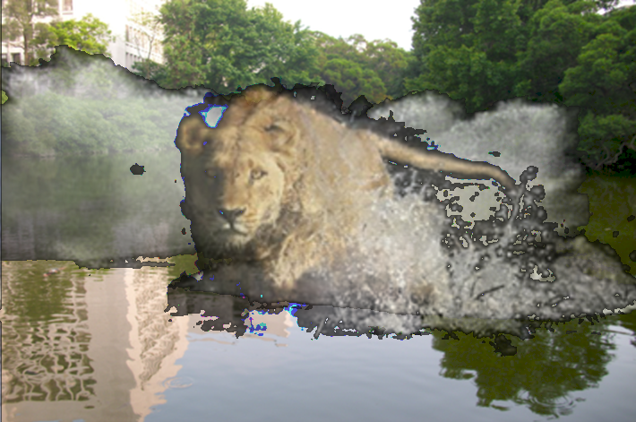
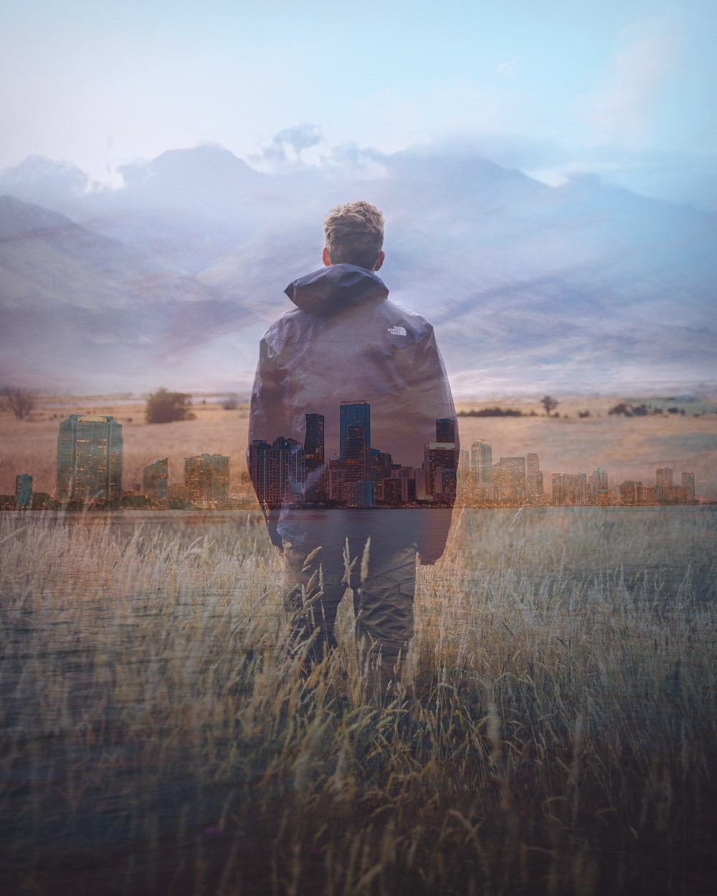
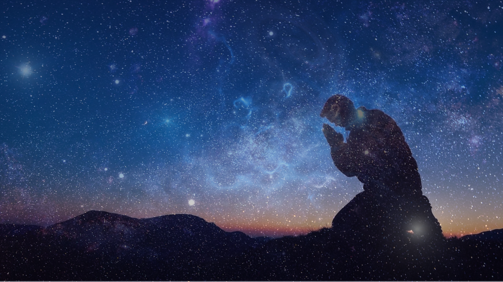

Image Composition
==

## Table of Contents

- [Introduction](#introduction)
- [Technologies](#technologies)
- [Setup](#setup)
- [Result](#result)
- [Notes](#notes)
- [Contact](#contact)
- [License](#license)

## Introduction

Given 2 to 3 images try and using purely coding to compose the images into one resulting image. The best composition is when the resulting image looks as natural as possible.

## Technologies

Prequisite:

*  MATLAB: recommended version R2019b

## Setup

1. Open MATLAB
2. select **~/MT_2019/assignment1** as the open folder
3. Open **image_comp.m**, **my_comp1.m**, **my_comp2.m**
4. You can execute the program by clicking run on the top bar
5. All the output will be in the folder **"./output"**

## Result

All the result can be seen in **"./output"** folder

The result of **image_comp.m** is the following image

The result of **my_comp1.m** is the following image

The result of **my_comp_2.m** is the following image

## Notes

You can find my notes of this project in [here](notes.md)

## Contact

Created by [@joycenerd](mailto:joycenerd@csie.io)

## License

 
